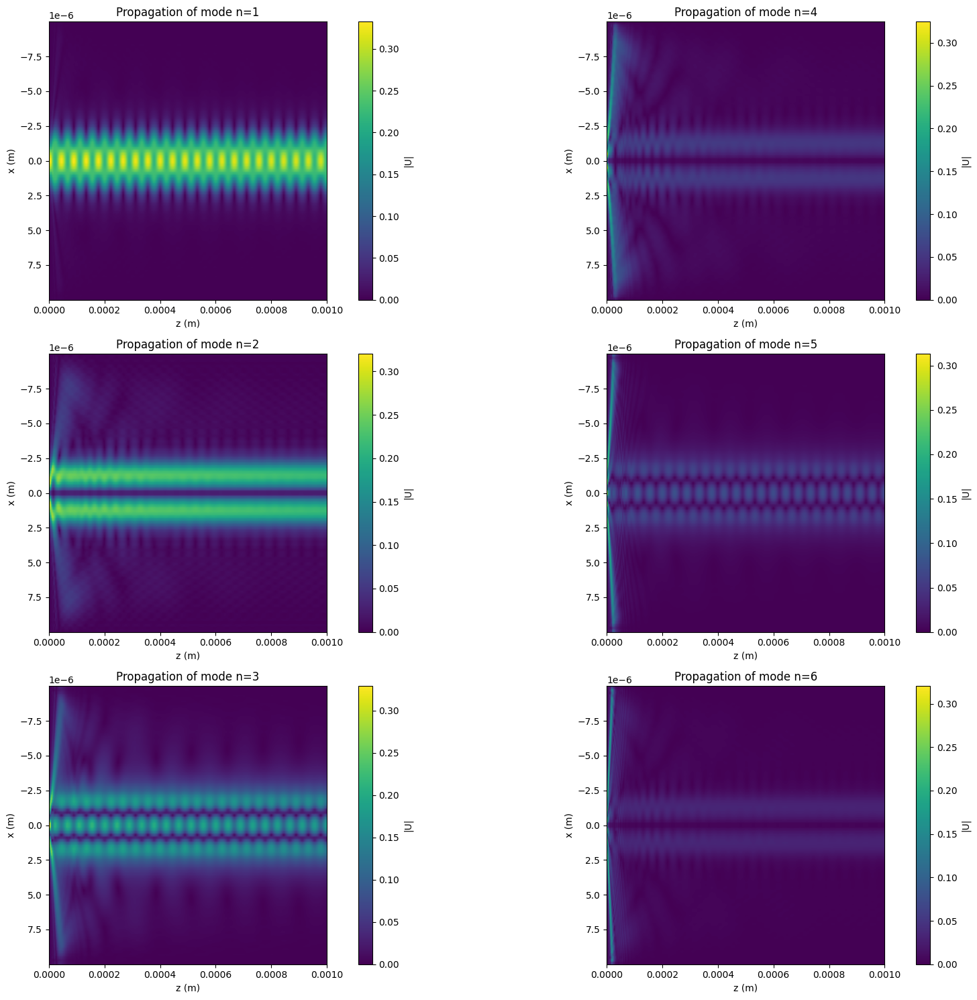

# 🧠 Computational Optical Imaging

This repository contains a collection of Jupyter notebooks developed as part of the **Computational Optical Imaging** course.  
Modern imaging systems combine traditional optical devices (lenses, endoscopes, cameras, laser scanners, etc.) with digital computation.  
In this course, we learn how to use **computational tools** to simulate optical systems and combine them with **neural networks** that process optical images.

---

## 📘 Course Overview

The course bridges **physical optics** and **machine learning**, exploring how light propagation, imaging, and scattering can be simulated and enhanced through deep learning.  

### Topics covered:
1. **Optical wave propagation**  
   - Free-space propagation  
   - Beam propagation method (BPM)  
   - Thin transparencies: lenses and gratings  
   - Imaging systems  
   - Digital holography  
   - Computer-generated holograms (CGH)

2. **Multi-layer networks**  
   - Neural architectures for image enhancement and inversion  
   - Training principles for optical simulations  

3. **Microscopy**  
   - UNet-based super-resolution  
   - Digital staining  
   - Phase retrieval from intensity images  

4. **Scattering media**  
   - Phase conjugation  
   - Matrix methods  
   - DNNs for focusing and imaging through multimode fibers (MMFs)  
   - Ptychography  

5. **Inverse scattering**  
   - Optical diffraction tomography  
   - MaxwellNet and inverse-scattering reconstruction  

---

## 📂 Repository Structure

| Notebook | Title / Topic |
|-----------|---------------|
| `GX_01.ipynb` | Free space propagation |
| `GX_02.ipynb` | Angular Spectrum Method, diffraction |
| `GX_03.ipynb` | GRIN, BPM |
| `GX_04.ipynb` | Zernike phase shift contrast microscope |
| `GX_05.ipynb` | Coherent & Incoherent, Fourier optics |
| `GX_06.ipynb` | NN for optics |
| `GX_07.ipynb` | Feature size |
| `GX_08.ipynb` | Gerchberg Saxton algorithm |
| `GX_09.ipynb` | Waveguides |
| `GX_10.ipynb` | Holography |
| `GX_11.ipynb` | Fibers |

---

## 🧠 Keywords

**Optical imaging**, **computational optics**, **holography**, **beam propagation method**, **neural networks**, **inverse problems**, **microscopy**, **phase retrieval**, **optical diffraction tomography**, **MaxwellNet**, **image reconstruction**.

---

## 📸 Example Output

  
   
  <em>Example of simulated propagating modes in a fiber.</em>

